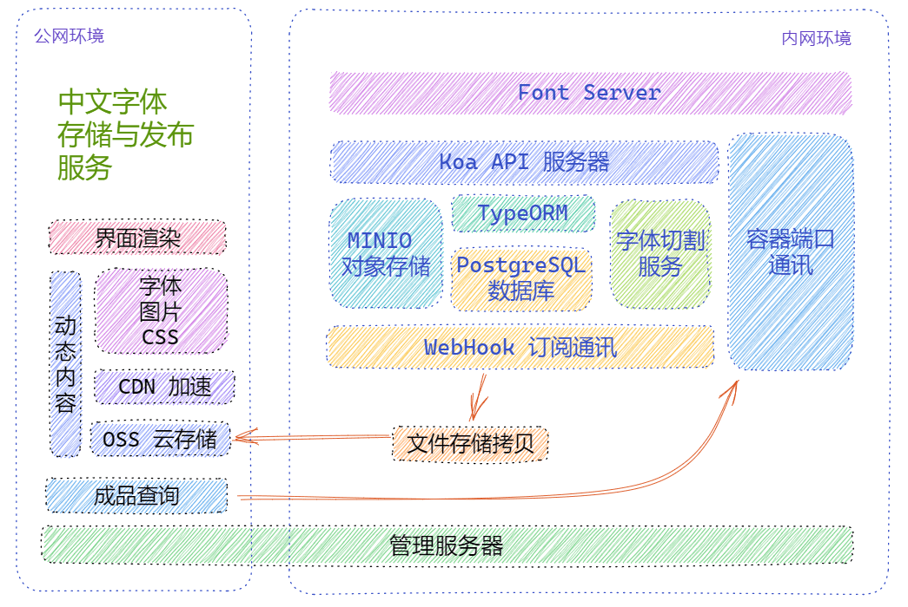

# font-server 中文字体切割服务器

| author: 江夏尧 | developing | v0.5 | 2023/5/17

## 软件定位

font-server 为内网使用的 **字体存储、管理服务**，通过 WebHook 对外通知信息，外部可以通过程序端口进行内部数据访问。功能描述如下：

1. ✅ 用户上传原始字体，内部存储原始字体
2. ✅ 触发切割功能 -> 切割服务器自动获取内部文件并开始切割 -> 存入内部文件系统
3. ✅ WebHook 订阅 > 触发 hook 事件 > 广播订阅 url
4. ✅ 切割完成事件 -> 外部的监听程序 -> 获取内部的切割分片 -> 部署到外部公开的 OSS 系统上
    1. 内外 OSS 系统应该使用同一路径
5. ✅ 用户通过 OSS 系统提供的文件 CDN 加速，嵌入字体加载 HTML 片段 -> 浏览器自动加载 CSS 文件和字体文件

## 软件设计

> 项目语言：Typescript 一把梭，配合 Docker 、shell 自动化



### 项目所提供的内容

1. Koa API Server

    1. 采用 Nodejs Typescript Koa 框架构建 Restful API 提供给内网管理服务器使用。
    2. 字体切割服务需要占用大量 CPU 资源，需要单独容器进行管理。但暂时采用同一个服务器进行服务。
    3. 通过 WebHook 事件通知外部更新。

2. PostgreSQL 数据库：

    1. 使用 Docker 容器中的 Postgres，不直接进行操作。
    2. 通过 Nodejs TypeORM 框架编写 Schema 和进行数据库容器的操作。
    3. 如果需要，可以变更为其它数据库。

3. MINIO 对象存储：

    1. 主要用于存储静态文件， 备份用户字体、存储切割字体分片。
    2. 对内网管理服务器提供静态文件接口服务。
    3. 内网使用对象存储存数据，防止数据丢失。

4. Webhook 订阅通讯

    1. 主要通过发布订阅模式广播项目系统内部的事件变化。
    2. 通过请求添加外部服务器的 url 到事件监听表中。
    3. 当系统内部触发事件时，向监听的 url 发送事件数据。

### 适配层

> 出于项目系统独立性考虑，适配层需要兼顾具体应用程序环境，与项目系统进行沟通。

1. 管理服务器

    1. 订阅项目事件，同步打包完成文件到云存储中。
    2. 提供字体成品列表查询服务
    3. 提供页面渲染（可选）

2. 云存储与 CDN

    1. 云存储主要用在公网备份字体数据，由于各家云存储的 API 不一致，故在系统内部需要有同一的备份文件。
    2. CDN 服务用于加速字体文件到达用户端。
    3. 生产环境中必须使用并发数大，速度快，距离近的 CDN 服务来提供稳定数据。

# 快速测试

1. **clone 本仓库** OR **fork 它并打开 Github Workspace**

2. 在根目录运行

```sh
docker-compose up -d
```

## 半自动测试

1. 自动下载测试字体文件

```bash
sudo sh scripts/init.sh # 需要 linux 环境 curl unzip
```

2. 自动注入基本测试数据

```sh
sudo HOST=http://localhost:3000 sh scripts/injectFonts.sh
```

3. VSCode 安装 Thunder Client
4. VSCode 设置中打上 Thunder Client 的 save to workspace 勾，然后重启就可以看到我之前的请求测试
