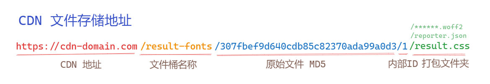

# font-server 中文字体切割服务器

| author: 江夏尧 | developing | v0.8 | 2023/5/22

## 软件定位

font-server 是一个用于内网的字体存储和管理服务，支持通过 WebHook 对外通知信息，并允许外部程序通过端口进行内部数据访问。

主要功能包括：

1. ✅ 用户可以上传原始字体文件，系统会保存这些字体文件。
2. ✅ 触发打包字体功能后，切割服务器会自动获取内部存储的字体文件，并对其进行切割，然后将切割后的字体片段存入内部文件系统。
3. ✅ 支持 WebHook 订阅功能，触发 hook 事件后，系统会广播订阅 url，通知外部程序相关事件信息。
4. ✅ 在切割完成后，外部监听程序可以获取内部的切割分片，并将其部署到外部公开的 OSS 系统上。特别地，内外 OSS 系统应该使用相同的路径。
5. ✅ 用户可以通过 OSS 系统提供的 CDN 加速访问字体文件，同时嵌入字体加载 HTML 片段，浏览器会自动加载相应的 CSS 文件和字体文件。
6. ✅ 提供简单的 Admin 界面，方便用户进行可视化操作。[Admin 地址](https://font-server.netlify.app)

## 软件设计

> 项目语言：Typescript 一把梭，配合 Docker 、shell 自动化


### 项目所提供的内容

1. Koa API Server

    1. 采用 Nodejs Typescript Koa 框架构建 Restful API 管理内部服务。
    2. 字体切割服务需要占用大量 CPU 资源，需要单独容器进行管理。但暂时采用同一个服务器进行服务。
    3. 构建 WebHook 事件通讯机制，提供事件发布机制的通讯推送
    4. 通过 access_token 简单划分权限，使得可以对外公开部分接口

2. PostgreSQL 数据库：

    1. 使用 Docker 容器中的 Postgres，不直接进行操作。
    2. 在 API Server 中通过 Nodejs TypeORM 框架编写 Schema 和进行数据库容器的操作。
    3. 如果需要，可以变更为其它数据库，但是 ORM 需要更改。

3. MINIO 对象存储：

    1. 主要用于存储静态文件， 备份用户字体、存储切割字体分片。
    2. 对内网管理服务器提供静态文件接口服务。
    3. 内网使用对象存储存数据，防止数据丢失。

4. Webhook 订阅通讯

    1. 主要通过发布订阅模式广播项目系统内部的事件变化。
    2. 通过请求添加外部服务器的 url 到事件监听表中。
    3. 当系统内部触发事件时，向监听的 url 发送事件数据。

### Pusher 适配层

> 出于项目系统独立性考虑，Pusher 适配层需要兼顾具体云存储环境，与项目系统进行沟通。

1. 管理服务器

    1. 订阅 Font Server 内部事件
    2. 第一次全量同步数据
    3. 增量同步文件到云存储中

2. 云存储与 CDN

    1. 云存储主要用在公网备份字体数据。由于各家云存储的 API 不一致，故在系统内部需要有同一的备份文件，同步文件到各个云存储中。
    2. CDN 服务用于在生产环境中加速字体文件到达用户端。
    3. 生产环境中必须使用并发数大，速度快，距离近的 CDN 服务来提供稳定数据。

### 订阅制沟通结构

1. Font Server 的字体管理核心部分是完全独立的，包括了 api、minio 和 db 三个部分。
2. 外部系统通过 WebHook 的订阅获取事件推送，如 Pusher 就是通过 WebHook 订阅内部的数据变化并进行推送的。
3. WebHook 由 Font Server 记录订阅者的 URL，在系统内部发生事件时，发送 POST 请求将包含信息的 JSON 发送给订阅者
4. 订阅者监听到变化之后进行数据同步等操作。

### 打包文件存储架构

1. 文件存储采用主从架构，Font Server 内部的文件系统为主，通过 Pusher 同步腾讯云、阿里云等外部从属云存储。
2. 主文件系统负责保存原始文件、打包文件副本、为 Font Server 内部提供数据。
3. 从文件系统通常可以开启 CDN 加速静态文件部署、支持防盗链等功能，适合于面向公众提供服务。
4. 文件系统中的文件都使用同样的路径存储与开放，各个文件系统只是域名不同



# 快速部署

1. **clone 本仓库** OR **fork 它并打开 Github Workspace**

2. 添加一些环境变量修改一下 docker-compose-yml

> 这些环境变量需要看看 docker-compose.yml 缺少什么，一般都是 Pusher 插件同步文件需要。
>
> 我会把环境变量写在 根目录的 .env 文件中，然后通过 docker-compose 使用
>
> docker-compose.yml 中有些用户名密码之类的可以进行修改，保证私密性

3. 在根目录运行

```sh
docker-compose --env-file=.env up -d
```

## 半自动测试

1. 自动下载测试字体文件

```bash
sudo sh scripts/init.sh # 需要 linux 环境 curl unzip
```

2. 自动注入基本测试数据

```sh
sudo HOST=http://localhost:3000 sh scripts/injectFonts.sh
```

# 接口文档

[Postman 文档](https://www.postman.com/konghayao/workspace/font-server/collection/18433126-4b25b13a-6c0e-40a4-9dec-ccf655d1660c?action=share&creator=18433126)

注意设置好你的接口环境哦

## 简单的几个接口

1. 获取切割完成的可用字体

```js
const root = ""; // 这里写 api 容器暴露的端口
const token = "api_admin_66618273"; // 这里写你的 admin token，默认是这个 token
const cdnRoot = '' // CDN 所在的 Root

// 请求这个 URL 可以获取到一个文件列表
fetch(root+"/split?limit=5&offset=0&state=2", {
  headers: {
    "Authorization", "Bearer "+token
  }
})
  .then(response => response.json())

  .then(res=>{
    // 我们来获取一下每个字体可以使用的 css 文件
    return res.map(i=>{
        return `${cdnRoot}/result-fonts/${i.folder}/result.css`
    })
  })
```

返回数据大致如下

```jsonc
[
    {
        "id": 15,
        "created_at": "2023-05-22T02:14:41.706Z",
        "updated_at": "2023-05-22T02:15:02.543Z",

        // 原始字体资源的信息
        "source": {
            "id": 10,
            "created_at": "2023-05-22T01:46:07.586Z",
            "updated_at": "2023-05-22T01:46:07.586Z",
            "path": "user-fonts/e28bdfa317ad66266bceb7f27fb6dde7.woff2",
            "name": "得意黑-woff2",
            "size": 950116,
            "md5": "e28bdfa317ad66266bceb7f27fb6dde7"
        },
        // 成品字体所在的文件夹
        "folder": "e28bdfa317ad66266bceb7f27fb6dde7/15",

        // 成品的文件列表
        "files": [
            "e28bdfa317ad66266bceb7f27fb6dde7/15/1c8e99fa9ef7c6c698d48417c2fe8765.woff2",
            "e28bdfa317ad66266bceb7f27fb6dde7/15/preview.png",
            "e28bdfa317ad66266bceb7f27fb6dde7/15/reporter.json",
            "e28bdfa317ad66266bceb7f27fb6dde7/15/result.css" // 最为重要的文件
        ],
        "state": 2
    }
]
```
