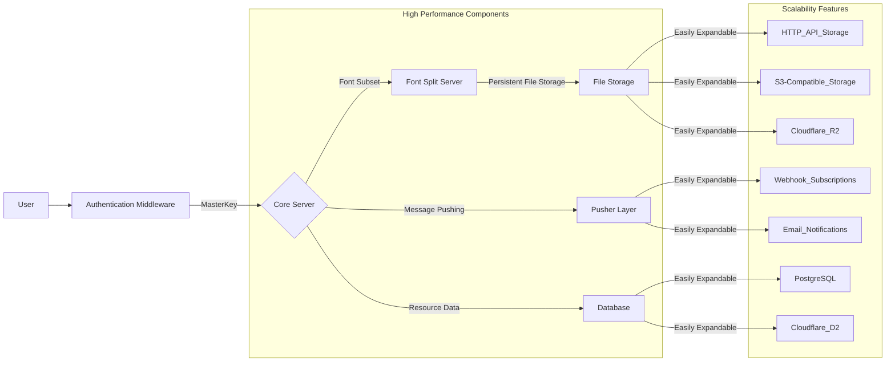

# font-server 第二版构建升级

## 目标

基于 Typescript 构建跨多个运行时、插件化的、解耦文件存储、消息订阅、数据存储的高扩展、高可用、高性能的字体切割服务器

1. 跨多个运行时，采用 elysia 服务器框架，提供一等一的跨平台体验。
2. 插件化，所有服务均为独立的 elysia 中间件，可以动态灵活调整参数。
3. 服务解耦，所有非 Typescript 服务均进行层级封装，只要实现相应的接口，即可直接调用。

## 架构拆分

1. 字体构建服务器
2. 行存储与查询架构
3. 文件存储架构
4. Pusher 推送层
5. 简单授权服务

